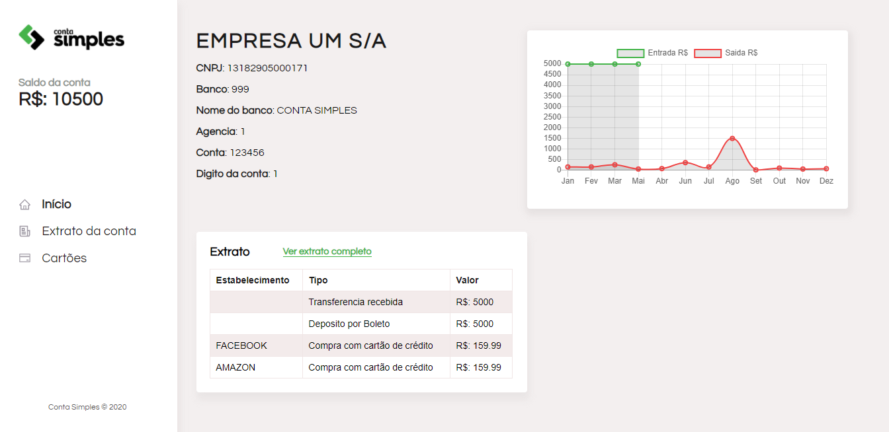

## Internet Banking

Para acessar a home do internet banking clique em `Entrar` na página de Login.

## Screenshots

## Instalação e configuração.

Faça um clone ou baixe esse repositório. Tenha instalado `npm` e `node` na sua máquina.

Instalação:

`npm install`  

Para iniciar o servidor da api:

`npx json-server --watch api/db.json --port 3004`  

Para visitar URL da api:

`localhost:3004/`

Para iniciar a aplicação:

`npm start` 

Para visitar o site:

`localhost:3000/`

## Tecnologias utilizadas

Gráfico:

`Chart.js`: https://www.chartjs.org/

REST API: 

`json-server`: https://www.npmjs.com/package/json-server

